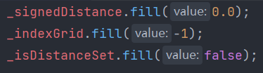
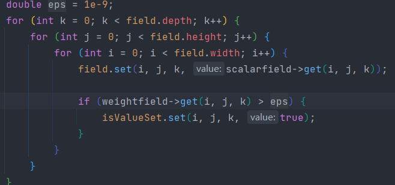
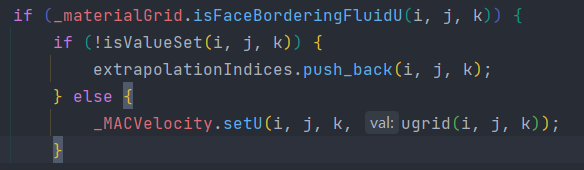
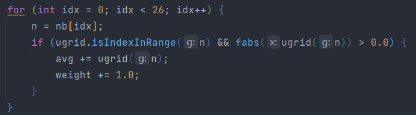
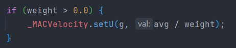
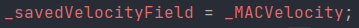
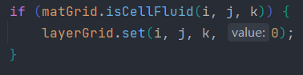
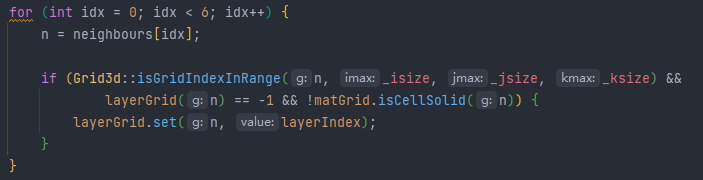

## 目录

*   [GridFluidSim3D](#gridfluidsim3d)

*   [模拟的步骤](#模拟的步骤)

    *   [1.更新网格类型](#1更新网格类型)

    *   [2.重建表面](#2重建表面)

    *   [3.更新levelset](#3更新levelset)

    *   [4.计算网格的速度场](#4计算网格的速度场)

    *   [5.**速度场外推**](#5速度场外推)

    *   [6.增加外力](#6增加外力)

    *   [7.计算压强、投影](#7计算压强投影)

    *   [8.速度场外推](#8速度场外推)

    *   [9.更新粒子速度](#9更新粒子速度)

    *   [10.粒子advect](#10粒子advect)

# 其他FLIP资源

# GridFluidSim3D

# 模拟的步骤

## 1.更新网格类型

移除所有在固体中的粒子

更新新增加粒子的队列

更新移除粒子的队列

**有流体粒子在的网格，标记为流体类型**

统计粒子数目

## 2.重建表面

## 3.更新levelset

（1）所有的网格levelset设为0

（2）计算

## 4.计算网格的速度场

以x为例：

（1）速度设为0

（2）P2G

遍历所有粒子，将速度附加给网格、并保存权重

标记哪些网格点设置过了（权重如果大于一个极小值，就是被设置过了）

（图片中的field是最终的速度场）

（3）把需要外推的网格idx加入一个列表中

**如果一个采样点挨着流体网格（2侧中任意1侧），且未被设初值，就加入队列中**

（4）外推

遍历所有需要外推的网格，统计它周围3\*3\*3的相邻网格的平均速度

权重>0，则将平均速度设为该点的速度

（5）y和z方向类似

（6）把速度场保存下来

## 5.**速度场外推**

操作的对象是上一步保存下来的速度场

（1）重设速度

把所有不挨着流体网格的速度采样点的速度设为0

（2）更新层次

设置层次网格，维度（x, y, z），不是MAC。初始值为-1

把所有流体网格的层次设为0：

**设置其他层的层数。紧紧挨着上一层的网格且层数为-1且该网格不为固体的，设为当前层数**

（3）设置速度

3个方向分别外推

以x方向为例：

**遍历所有网格采样点（MAC网格）**:

判断是否需要外推：

（1）与当前层的网格（普通网格）相邻（2侧中的一侧）

（2）与上一层的网格不相邻（2侧中的一侧）

（3）两侧不挨着固体

设置速度（插值）：寻找紧紧挨着本层网格的上一层网格，求速度的平均值

## 6.增加外力

x、y、z方向分别增加（MAC）：

如果一个采样点挨着流体网格（2侧中的一侧），增加外力f\*dt

## 7.计算压强、投影

## 8.速度场外推

对投影完的速度场

## 9.更新粒子速度

## 10.粒子advect

RK4